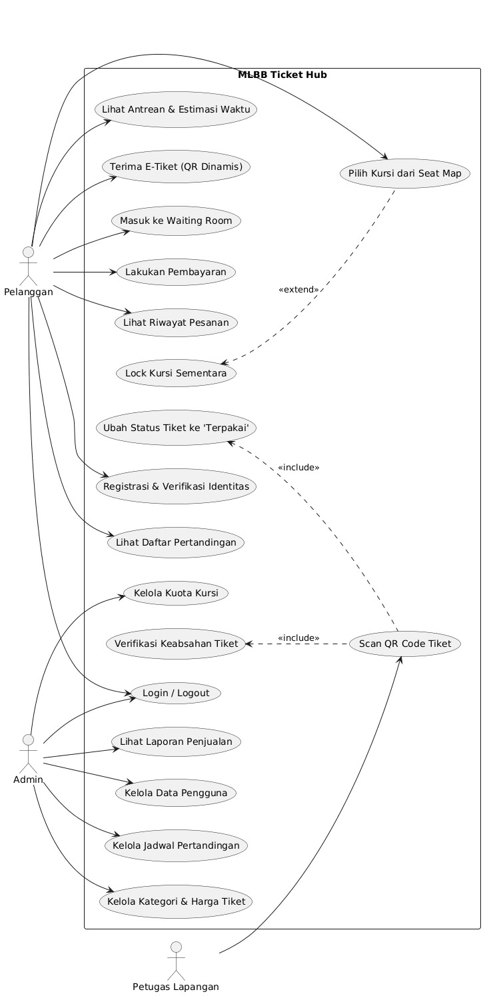
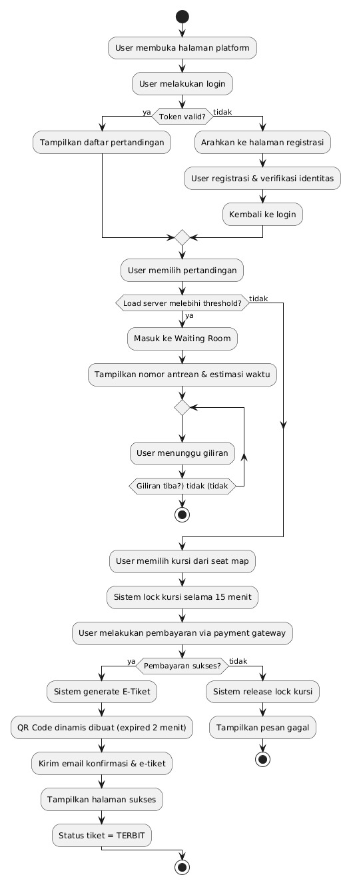
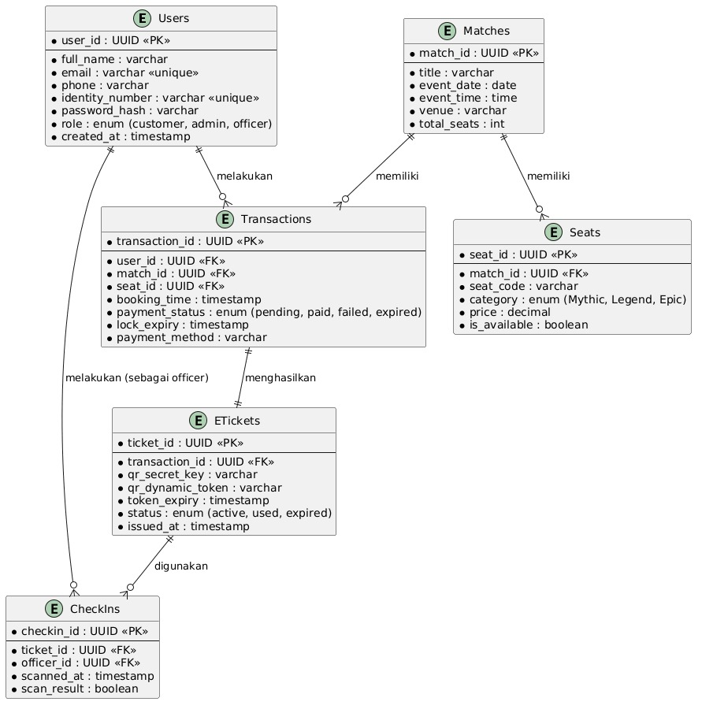
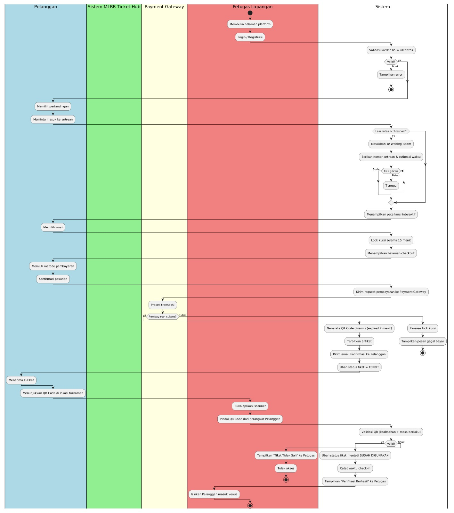

# TUGAS APSI PERTEMUAN 9 - System Documentation

MLBB Ticket Hub adalah platform untuk pemesanan dan manajemen tiket pertandingan Mobile Legends: Bang Bang (MLBB). Platform ini mengatur interaksi mulai dari antrean pembelian oleh pelanggan, manajemen data oleh admin, hingga proses *check-in* di lokasi turnamen.

Dokumen ini menjelaskan arsitektur sistem mulai dari interaksi pengguna (Use Case), alur transaksi (Activity & BPMN), hingga struktur basis data (ERD).

---

## 1. Use Case Diagram: Interaksi Aktor dengan Sistem

Diagram Use Case memetakan siapa saja yang menggunakan sistem dan fitur apa saja yang dapat mereka akses. Terdapat tiga aktor utama dalam platform ini:

* **Pelanggan:**
  * Melakukan **Login / Logout** dan **Registrasi & Verifikasi Identitas**.
  * Melihat **Daftar Pertandingan** dan memilih **Kursi dari Seat Map** (yang akan memicu *Lock Kursi Sementara*).
  * Masuk ke **Waiting Room** dan melihat **Antrean & Estimasi Waktu** saat lalu lintas server tinggi.
  * Melakukan **Pembayaran** pesanan.
  * Menerima **E-Tiket (QR Dinamis)** dan melihat **Riwayat Pesanan**.

* **Admin:**
  * Melakukan **Login / Logout** ke portal *back-office*.
  * Mengelola **Jadwal Pertandingan**, **Kategori & Harga Tiket**, serta **Kuota Kursi**.
  * Mengelola **Data Pengguna**.
  * Melihat **Laporan Penjualan**.

* **Petugas Lapangan:**
  * Melakukan **Login / Logout** pada perangkat pemindai di lokasi acara.
  * Melakukan **Scan QR Code Tiket** milik pelanggan, yang secara otomatis akan memicu proses **Verifikasi Keabsahan Tiket** dan mengubah status tiket menjadi **'Terpakai'**.

---

## 2. Activity Diagram: Alur Proses Pembelian Tiket

Activity Diagram ini memodelkan alur kerja sistem dari sudut pandang pengguna (Pelanggan) saat melakukan proses pembelian tiket secara *end-to-end*:

* **Autentikasi:** Pengguna membuka platform dan melakukan Login. Jika belum memiliki akun, pengguna diarahkan ke halaman registrasi dan verifikasi identitas.
* **Pemilihan Pertandingan & Antrean:** Pengguna memilih pertandingan. Sistem akan mengecek beban server; jika melebihi batas (*threshold*), pengguna dimasukkan ke *Waiting Room* untuk menunggu giliran.
* **Pemilihan Kursi:** Pengguna memilih kursi dari peta kursi yang tersedia. Sistem secara otomatis mengunci (*lock*) kursi tersebut selama 15 menit.
* **Pembayaran:** Pengguna diarahkan ke *Payment Gateway*. 
  * Jika gagal/waktu habis: Sistem melepas kunci kursi dan menampilkan pesan gagal.
  * Jika sukses: Sistem melanjutkan ke proses penerbitan.
* **Penerbitan E-Tiket:** Sistem membuat *Dynamic QR Code* (kadaluarsa tiap 2 menit untuk keamanan), mengirim email konfirmasi, dan mengubah status tiket menjadi "TERBIT".

---

## 3. Entity Relationship Diagram (ERD): Struktur Basis Data

ERD ini memetakan struktur basis data yang digunakan oleh sistem untuk menyimpan dan mengelola informasi relasional:

* **Users:** Menyimpan kredensial dan identitas pengguna (Pelanggan, Admin, Petugas) dengan primary key `user_id`.
* **Matches:** Menyimpan detail jadwal, lokasi, dan total kursi sebuah pertandingan.
* **Seats:** Menyimpan detail kursi (kategori Mythic, Legend, Epic, harga, dan ketersediaan).
* **Transactions:** Entitas pusat yang mencatat riwayat pembelian. Menghubungkan `Users`, `Matches`, dan `Seats` serta mencatat status pembayaran dan batas waktu *lock* kursi.
* **ETickets:** Menyimpan data tiket digital yang dihasilkan dari transaksi sukses, termasuk *secret key* dan *dynamic token* untuk keamanan pemindaian QR.
* **CheckIns:** Mencatat riwayat pemindaian tiket di lapangan oleh petugas, mencakup waktu scan dan hasil validasi.

---

## 4. BPMN: Alur Proses Lintas Fungsi

Diagram BPMN (Business Process Model and Notation) ini membagi proses bisnis ke dalam beberapa *swimlane* untuk memperjelas tanggung jawab masing-masing pihak:

* **Pelanggan:** Berperan di sisi *front-end* untuk memilih pertandingan, mengantre, memilih kursi, melakukan konfirmasi pembayaran, dan menunjukkan QR Code kepada petugas di venue.
* **Sistem MLBB Ticket Hub:** Menjadi antarmuka interaksi awal bagi pelanggan sebelum diteruskan ke proses *back-end*.
* **Payment Gateway:** Pihak ketiga yang memproses transaksi finansial pelanggan dan mengembalikan status (sukses/gagal) ke sistem.
* **Petugas Lapangan:** Berperan di lokasi untuk memindai QR code pelanggan dan memberikan izin masuk berdasarkan hasil validasi sistem.
* **Sistem (Back-end):** Menangani logika komputasi utama seperti validasi login, manajemen *Waiting Room*, penguncian kursi sementara, pembuatan *Dynamic QR Code*, serta pencatatan waktu *check-in*.
